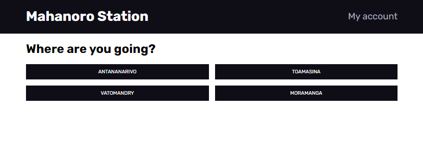
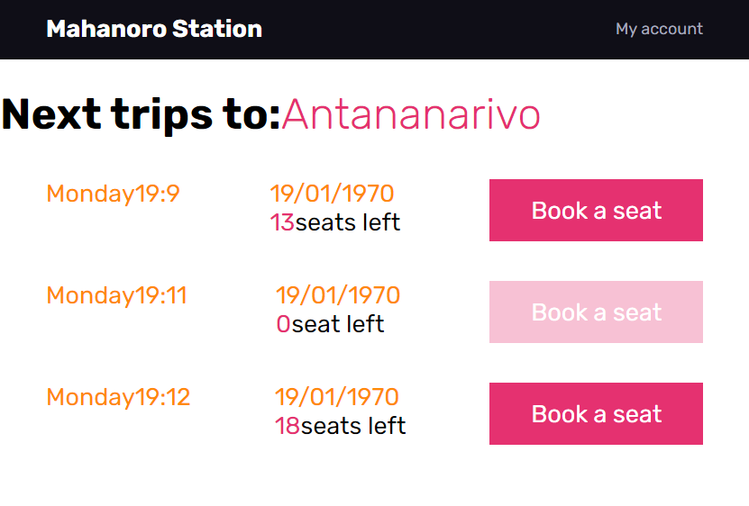
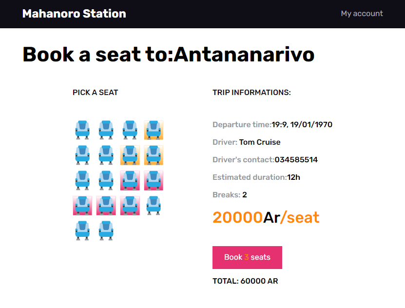
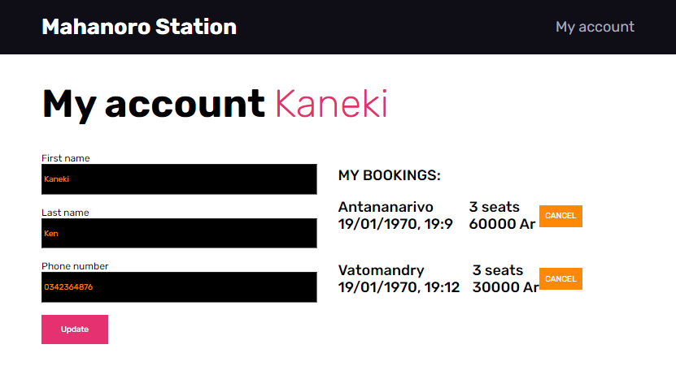

<h1 align="center">{Mahanoro station}</h1>

<div align="center">
  <h3>
    <a href="https://mahanoro-station-daniel.netlify.app/">
      Demo
    </a>
    <span> | </span>
    <a href="https://github.com/voromahery/mahanoro-station">
      Solution
    </a>
  </h3>
</div>

<!-- TABLE OF CONTENTS -->

## Table of Contents

- [Overview](#overview)
  - [Built With](#built-with)
- [Features](#features)
- [How to use](#how-to-use)
- [Contact](#contact)

<!-- OVERVIEW -->

## Overview









- Feel free to visit my demo at [https://mahanoro-station-daniel.netlify.app/](https://mahanoro-station-daniel.netlify.app/)

## My experience

- I was struggle to deal with selecting the seats and activate the cancel buttons in the account page.

## Structure of the code

- First, I created an HTML in which I created the root then, grabbed the root and put it in index.js. After that, I created some JSX in the App component then, I wrapped the App inside the `Router`. In the App component, I put some component which wrapped by `Path` and the block of path are wrapped by `Switch` in order to allow us to go in different pages.

- Secondly, I created a local store stored in store folder, so that it is possible to update all about the user, to toggle the modal. I created actions which are stored in a folder called action and linked them with reducers in a folder called reducers.

- In the next step, I created a store and stored it via `Provider` in order to let us be able to get the data stored in the store everywhere.

### Place option page (first page)

- I created an array of four cities in the local store and then I mapped them.
- All of those buttons are stored in `Link` and `useParams()`, which is a component from `react-router-dom`, in order to let us navigate to the **Next trip** page according to the city name. 

### Next trip page (second page)

- The datas in one city are mapped in order to list them all. The buttons are wrapped by `Link` and `useParams()` is also used in order to navigate to the **Seat booking page**.  


### Booking page (third page)

- All seats are mapped. The available seat are clickable whereas the unavailable ones are disabled and have red background.
- `some()` methode is used in order to click a seat or cancel the selecting. `useDispatch()` is used to activate the action of a reducer and `useSelector()` is for grabbing a state from the store. 
- When all booking are finished, the **add seat** button will display the modal and then the button check account in the modal brings us to the account page.


## Any further improvement:

- If I had more time, I would style my work the same in the design and improve other functionalities.

## Knowledge acquired

- I improved my skill by using **Redux** and **Redux hook**. Not only that but it reminds me of using `reduce()` in order to calculate the price of the bookings.

## Challenging part

- For me, the most challenging part is choosing the seat and activate the **cancel** button in the account page

### Built With

- [Redux](https://react-redux.js.org/);

## Features

- [styled component](https://styled-components.com/)
- [Redux](https://react-redux.js.org/)

## How To Use

To clone and run this application, you'll need [Git](https://git-scm.com) and [Node.js](https://nodejs.org/en/download/) (which comes with [npm](http://npmjs.com)) installed on your computer. From your command line:

```bash
# Clone this repository
$ git clone https://github.com/your-user-name/your-project-name

# Install dependencies
$ npm install

# Run the app
$ npm start
```

## Contact

- Website [Daniel-website](https://portfolio-onja-daniel.netlify.app/)
- GitHub [@voromahery](https://github.com/voromahery)
